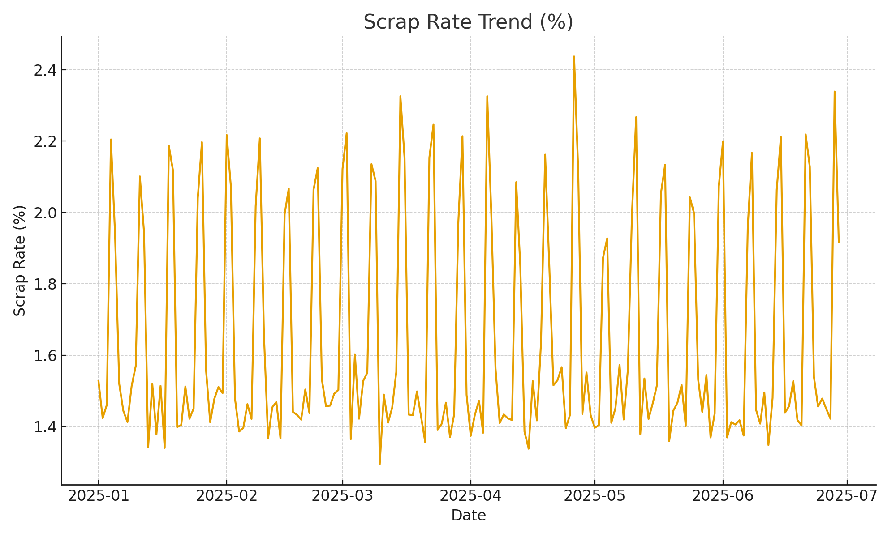
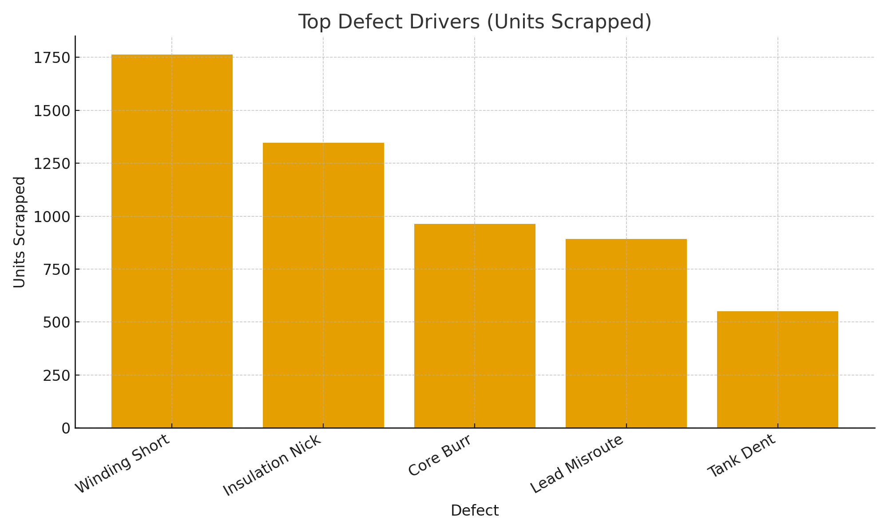
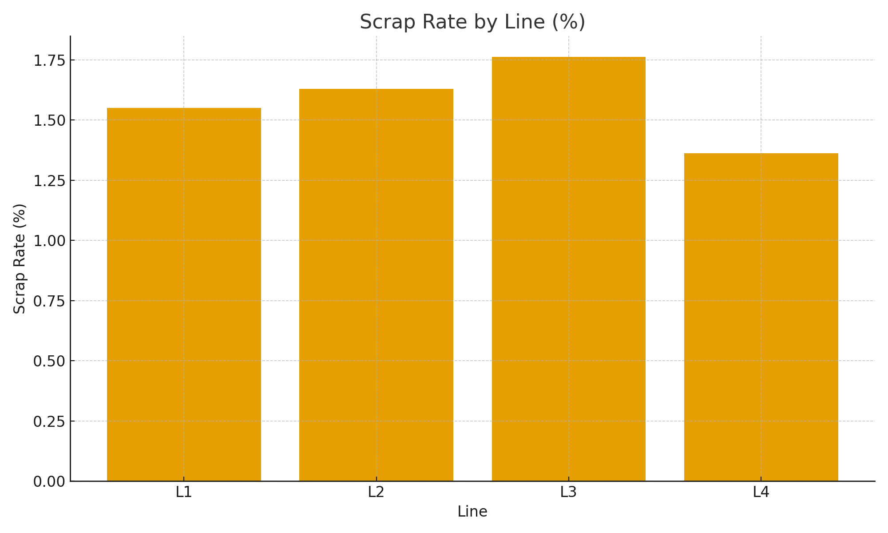
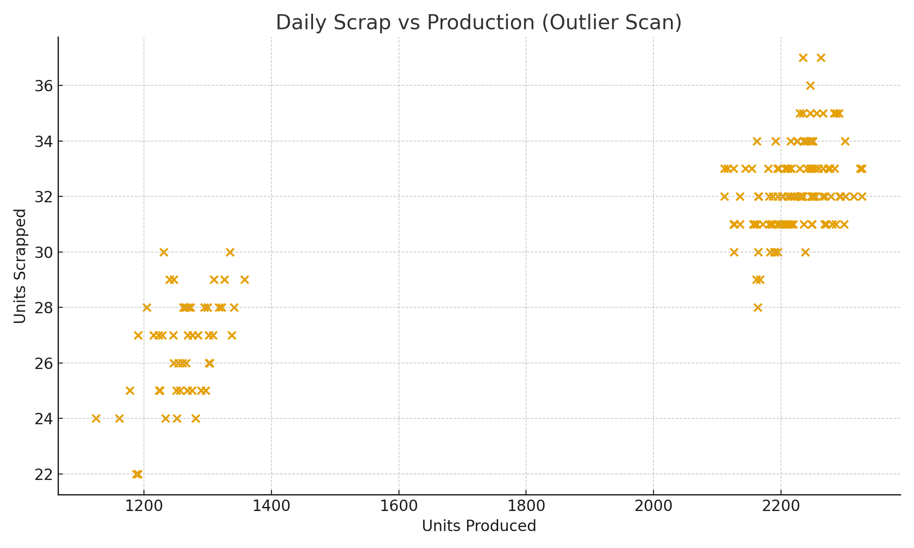

# 🏭 Scrap Rate Analytics — Manufacturing Cost Reduction Case Study (Python + SQL + CSV)

This project delivers a complete analytical system designed to **reduce scrap cost**, expose financial waste, and help production teams make data-backed decisions.  
Using Python, SQL, and structured CSV workflows, it transforms raw factory scrap data into **dollar-impact insights** that drive measurable savings.

---

## 💸 Business Problem — Scrap Is Quietly Killing Margin  
In manufacturing, scrap doesn’t just hurt quality — it destroys profit.

Without structured analytics, plants struggle to answer financially critical questions:

- Which production lines generate the **highest cost of scrap**?  
- Which defects waste the most **material dollars**?  
- When does scrap cost spike, and what causes it?  
- Are improvement projects actually **saving money** or just shifting problems around?  

This project provides the visibility needed to translate daily scrap losses into controlled, optimized operations.

---

## 🔍 What This Project Does (Cost-Focused)

- Cleans raw scrap + production CSV files into consistent datasets  
- Calculates operational + financial KPIs:
  - **Scrap Cost**  
  - **Scrap Rate %**  
  - **Cost by Defect Category**  
  - **Cost by Production Line**  
  - **Unit Cost Lost**  
  - **Daily Financial Variance**  
- Detects trends, spikes, and repeatable defect patterns  
- Generates static PNG visuals for engineering reviews, CI meetings, and supervisor reports  
- Builds a repeatable analytical model ready for:
  - Daily production meetings  
  - Lean manufacturing initiatives  
  - CAPA validation  
  - Monthly cost-reduction reviews  

All data is synthetic and created for safe portfolio demonstration.

---

## 💰 Business Value — Direct Cost Savings

This analytics engine helps manufacturing teams understand **where money is being lost and how to stop it**.

- Identifies the top scrap cost drivers in minutes  
- Exposes high-cost defects that hide behind small scrap quantities  
- Shows which production lines consistently lose the most money  
- Strengthens monthly budgeting and cost reduction programs  
- Supports Lean/CI teams with measurable, financial KPIs  
- Replaces reactive problem-solving with proactive cost control  

It finally answers the most important operational question:

**“Where is our money going every single day?”**

---

## 📸 Included Visual Outputs

### 📈 Scrap Rate Trend (Cost Impact)
Shows daily scrap performance and high-cost spike days.

---

### 💵 Defect Pareto — Scrap Cost by Defect
Reveals which defects drain the most money.

---

### 🏭 Scrap Cost by Production Line
Highlights the production lines with the highest financial waste.

---

### 🔍 Outlier Detection — High-Cost Days
Identifies abnormal days that may reflect poor setup, misfeeds, material issues, or operator errors.

---

## ✅ Summary  
This project shows how manufacturing teams can leverage Python and SQL to reduce scrap cost, improve operational efficiency, and protect profit margins.  
It connects the shop floor to the financial statement—turning operational waste into measurable savings.

